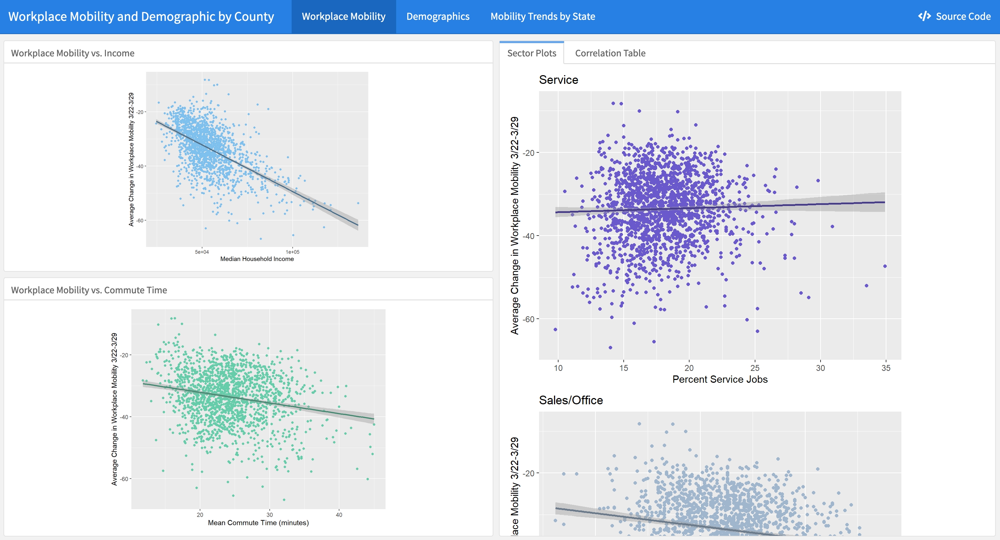
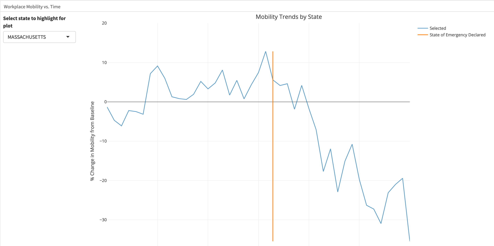

# Mobility and Predictors of Movement During COVID-19 

Rebecca Francis, Kyran Adams, Mario Paciuc, and Connor Rothschild

## Introduction

The COVID-19 virus has had an unprecedented effect on the extent to which Americans move around the country. Recommendations by local, state and federal governments have urged citizens to stay home, practice social distancing, and limit travel.

However, the ability to stay home depends on various inequalities between communities. For example, the [New York Times](https://www.nytimes.com/2020/04/05/opinion/coronavirus-social-distancing.html) has explored the relationship between socioeconomic factors and mobility and concluded that those with higher socioeconomic status were able to socially distance earlier than those with lower socioeconomic status.

Given those results, questions arise such as:

- *What other characteristics are predictors of the ability for a community to socially distance?* 
- *Taking into account a certain county’s characteristics, can we make robust predictions about future mobility?*
- *Are ‘stay-at-home orders’ and similar laws effective at reducing the distance citizens travel? How do their effectiveness differ by implementation and stringency?*

## Data and Methods

In order to answer these questions, we sought data regarding county characteristics related to mobility during COVID-19, as well as a host of demographic and socioeconomic variables.

  Mobility data was taken from Google’s COVID-19 Community Mobility Reports. These reports provide the daily percentage change in mobility at the county level relative to a baseline established prior to the spread of the coronavirus. Specifically, the baseline is the median value of mobility (which incorporates both number of visits and length of stay) from January 3, 2020 to February 6, 2020. A separate baseline is calculated for each day of the week. Furthermore, the change in mobility is divided into six categories: workplace, retail and recreation, grocery and pharmacy, parks, transit stations, and residential. In our initial analyses, we are considering each category separately and averaging across the last seven days of available data (March 23 to March 29).

We also included data from the American Community Survey (ACS) 2018 5-year survey and the Center for Disease Control’s Social Vulnerability Index (SVI). The ACS contains data profiles of social, economic, and demographic data for each county in the United States. To explore the relationship between workplace mobility and some basic county demographic characteristics, we employed five main ACS variables: median household income, mean commute time, percent employed in the service jobs, percent employed in sales and office jobs, and percent employed in transport and production jobs. The CDC’s SVI dataset contains other demographic information from which we pulled variables on persons living below the poverty line and county minority percentages. These variables gave us insight into how COVID-19 has particularly affected mobility to the workplace as well as the relationship between basic demographics and overall mobility. 

Finally, we pull data regarding state policies that encourage or mandate social distancing, such as stay-at-home orders. [This data](https://docs.google.com/spreadsheets/d/1zu9qEWI8PsOI_i8nI_S29HDGHlIp2lfVMsGxpQ5tvAQ/edit) will allow us to explore the effectiveness of stay-at-home orders and similar regulations. By exploring trends in mobility before and after the implementation of such laws, we can determine *what kind* of social distancing laws work, and which don’t.

We also created visualizations to explore the distribution of mobility throughout the country relative to the baseline.

We’ve also created an [**interactive version**](https://connorrothschild.github.io/covid-mobility/viz/) of this map, which allows us to explore these trends temporally. The visualization allows the user to select a given date to explore mobility at a given time, and the tooltip that appears on hover allows users to explore mobility for a given county:

## Conclusions

To answer our questions about important predictive relationships, we created regression plots that explore variables such as socioeconomic status, race, and economic characteristics. [**This dashboard**](https://connorrothschild.github.io/covid-mobility/viz/CHRP_mobility) contains our analysis, including visualizations and tables depicting the relationship between: 

- Change in average workplace mobility and:

- - Income
  - Commute time
  - Service, sales/office, and production/transportation jobs

- Change in average overall mobility and race/ethnicity 

- Change in average overall mobility and poverty levels 

We found significant correlations between mobility and income and different job sectors, exposing inequalities in how the virus has affected a wide range of employment. Specifically, service jobs have shown no significant change in mobility, indicating these employees have continued to work as normal as they are likely in jobs considered “essential” and thus not work-from-home. Sales and office jobs, however, have shown a significant decrease in mobility, indicating these employees have largely moved to working from home. 

 Social demographic data highlights similar disparities. Asian-Americans, for example, have shown a dramatic decrease in workplace mobility, perhaps due to the stigma attached to the virus leading to reductions in business. Minorities as a whole, however, do not show a negative relationship with average change in mobility, indicating these groups have perhaps not had equal ability to limit travel. Relatedly, the relationship between persons below the poverty line and change in mobility is positive. This may be because these people are working low-paying, “essential” jobs that cannot be done from home; or they may live in areas where they have limited access to essential businesses and thus have to travel far for groceries and other essential items. We hope to explore these interesting predictive variables further to establish more concrete relationships in the coming weeks as we continue to work on this project.

We also explored the effect of stay-at-home orders. To do this, we created a state-by-state visualization of mobility over time superimposed with the dates that each state declared a state of emergency. This allowed us to see the relationship between these two events. From these plots, we can conclude that there seems to be a point in which states’ mobility significantly goes down, and this point is correlated with the date of the state of emergency, as can be seen in this example of Massachusetts:

## Impact

Our research will help us understand the effectiveness of stay-at-home orders at reducing travel, the effectiveness of social distancing on reducing transmission, and the various factors that may influence one’s ability to ‘distance.’ If we have a better understanding of when and why people socially distance, that lawmakers can address and account for these issues when creating policies. For example, if we know that communities without access to grocery stores are much less likely to socially distance, then laws might want to address this rather than ignore it.

Understanding communities’ disparate ability to socially distance is crucial to understand which communities are most vulnerable to the virus. Such insights may be able to inform a policy response, so that more resources can be allocated to protecting these communities. The insights we gather from this analysis could inform broader discussions of equity, the unequal impact of seemingly indiscriminate viruses, and socioeconomic inequality more broadly. 

## Future Plans

We intend to build a regression model which predicts a county’s change in mobility (relative to the baseline) based on various demographic and socioeconomic variables. Because the ACS data provides hundreds of variables, many of which are highly correlated, careful feature extraction and dimensionality reduction will be crucial to creating a robust model. Methods such as principal component analysis and Lasso regression will be combined with expert knowledge from previous studies to obtain a smaller set of potential features. Cross-validation can then be used to determine the best model. In addition to making predictions, a model such as random forest will also provide feature importances, quantifying the impact that each feature has on mobility. 

Once such a model has been created, the effect of government regulations on mobility can be assessed. For example, the difference between expected and actual change in mobility can be compared across counties with varying regulations. Having accounted for the demographic and socioeconomic characteristics of each county, these comparisons are less likely to be affected by confounding variables and will hopefully allow lawmakers to determine the appropriate course of action. 